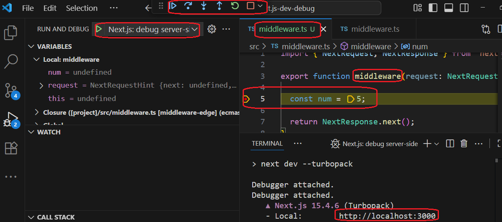
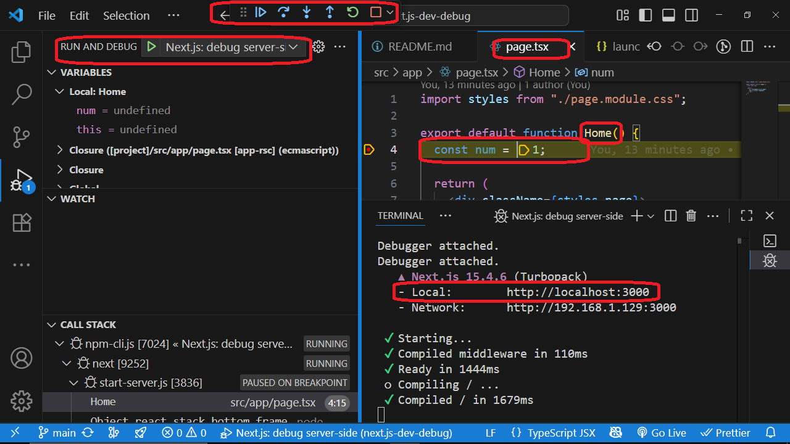
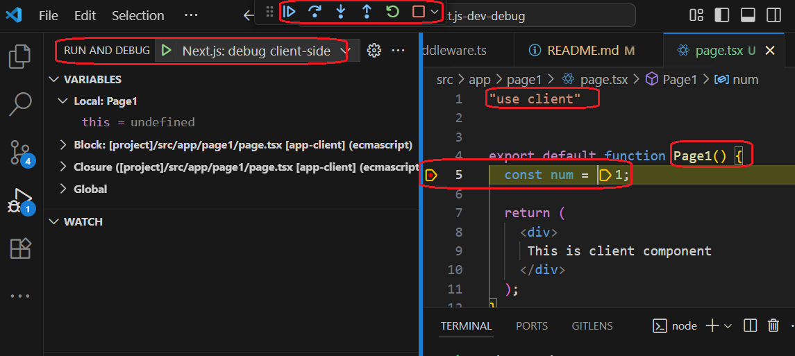
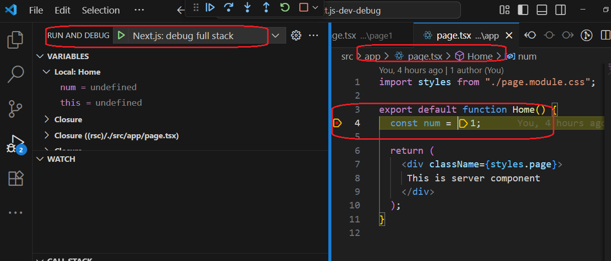

<h1>Project Name</h1>
Debug next.js using vscode

<h2>Project Description</h2>
<p>
    This project provides a comprehensive guide for debugging Next.js applications using Visual Studio Code. It details how to set up the necessary <strong>.vscode/launch.json</strong> configuration file to enable debugging for various types of Next.js code, including <strong>server components</strong>, <strong>client components</strong>, <strong>middleware</strong>, and <strong>server actions</strong>. The guide offers step-by-step instructions for debugging both server-side and client-side code, as well as a seamless <strong>"full stack"</strong> debugging approach.
</p>

<h2>Motivation</h2>
<p>
You have a next.js app router application and you want to debug a specific function during development by setting a breakpoint and stepping through the code. This function can be on the server-side or the client-side. What are your options?
</p>

options :
<ul>
<li>VS Code</li>
<li>Chrome DevTools (possible on both client-side and server-side)</li>
</ul>

<p>
We will concentrate on using VS Code and a <code>.vscode/launch.json</code> file. This seems to be the best way because it allows us to debug both server and client-side code from the familiar VS Code environment.
</p>
<p>
I want to debug:
</p>
<ul>
<li>server component</li>
<li>client component</li>
<li>server action</li>
<li>middleware</li>
</ul>

<h2>Installation</h2>
<p>
  Create the <code>.vscode/launch.json</code> file in the project root. You can find the necessary configuration code on <a href='https://nextjs.org/docs/app/guides/debugging'>the official Next.js debugging guide</a>.
</p>

<p>
  Install the project dependencies by running the following command in your terminal:
</p>

```bash
pnpm i
```

<h2>Usage</h2>
<p>
Debugging a Next.js application in VS Code involves three main steps: setting a breakpoint, starting the debugger, and selecting a configuration. The following sections will provide detailed, step-by-step demos for specific use cases, but the core process is as follows:
</p>
<ol>
<li>Put a <strong>breakpoint</strong> in your source files (<code>.ts</code>, <code>.tsx</code>) by clicking in the left margin next to the line number.</li>
<li>From the <strong>"Run and Debug"</strong> view, select a debugging configuration from the dropdown menu (e.g., "Next.js: debug server-side"). This step is optional if you have already selected a configuration and do not need to switch.</li>
<li>Start the <strong>debugger</strong> by pressing <code>F5</code>.</li>
</ol>
<p>
After the initial setup, VS Code remembers your last-used configuration. For subsequent debugging sessions, you can simply press <code>F5</code>. If you need to switch configurations, open the "Run and Debug" view (or use the shortcut <code>Ctrl + Shift + D</code>), select a new one, and then press <code>F5</code>.
</p>

<h2>Technologies Used</h2>
<ul>
<li>Next.js</li>
<li>TypeScript</li>
<li>VS Code</li>
</ul>

<h2>Basic launch.json concepts</h2>
<p>Here is a breakdown of the key concepts and properties used in a <code>launch.json</code> file for debugging in VS Code:</p>
<ul>
<li>
<strong>name</strong>: A user-friendly name for the launch configuration that appears in the VS Code dropdown menu.
</li>
<li>
<strong>type</strong>: The type of debugger to use. Common values include <code>node</code> for Node.js, <code>chrome</code> for Chrome-based browsers, and <code>firefox</code> for Firefox.
</li>
<li>
    <strong>request</strong>: The mode of the debugger. <code>launch</code> starts a new Node.js process (Next.js app) to debug, while <code>attach</code> connects to an already running Node.js process (Next.js app).
</li>
<strong>command</strong>: Used with <code>type: "node-terminal"</code>, this specifies the shell command to run to start the application, such as <code>pnpm run dev</code>.
</li>
<li>
<strong>url</strong>: The URL that the debugger should open and attach to when the debug session starts. This is typically used for client-side debugging configurations.
</li>
<li>
<strong>reAttach</strong>: A boolean property that, if set to <code>true</code>, allows the debugger to automatically reattach to the target if it disconnects and reconnects, which is useful for debugging server restarts.
</li>
<li>
<strong>pathMappings</strong>: An array of objects that map URLs or paths from the server to the corresponding local file system paths. This is crucial for source-level debugging of web content.
</li>
<li>
<strong>runtimeArgs</strong>: An array of command-line arguments to pass to the runtime executable. For Node.js, this is often used to pass flags like <code>--inspect</code> to enable debugging.
</li>
<li>
<strong>skipFiles</strong>: An array of file globs to skip while debugging. This is useful for stepping over library code or other files you don't need to debug.
</li>
<li>
<strong>serverReadyAction</strong>: An object that specifies an action to perform once a server, started by the debugger, is ready. It can be used to automatically launch a browser to a specific URL.
</li>
<li>
<strong>workspaceFolder</strong>: A predefined variable in VS Code that represents the path to the folder opened in the current workspace. It's often used to construct paths for programs or files.
</li>
</ul>


<h2>Code (configuration)</h2>

This is the launch.json file

```json
{
  "version": "0.2.0",
  "configurations": [
    {
      "name": "Next.js: debug server-side",
      "type": "node-terminal",
      "request": "launch",
      "command": "pnpm run dev"
    },
    {
      "name": "Next.js: debug client-side",
      "type": "chrome",
      "request": "launch",
      "url": "http://localhost:3000"
    },
    {
      "name": "Next.js: debug client-side (Firefox)",
      "type": "firefox",
      "request": "launch",
      "url": "http://localhost:3000",
      "reAttach": true,
      "pathMappings": [
        {
          "url": "webpack://_N_E",
          "path": "${workspaceFolder}"
        }
      ]
    },
    {
      "name": "Next.js: debug full stack",
      "type": "node",
      "request": "launch",
      "program": "${workspaceFolder}/node_modules/next/dist/bin/next",
      "runtimeArgs": ["--inspect"],
      "skipFiles": ["<node_internals>/**"],
      "serverReadyAction": {
        "action": "debugWithEdge",
        "killOnServerStop": true,
        "pattern": "- Local:.+(https?://.+)",
        "uriFormat": "%s",
        "webRoot": "${workspaceFolder}"
      }
    }
  ]
}
```

<h2>Demo</h2>

<p>
The Demo provides a set of step-by-step guides for debugging different parts of a Next.js application, including both server-side and client-side code. The following demos show you how to use specific launch configurations to target breakpoints in your middleware, server components, client components, and server actions.
</p>

<h3>Debug server code : middleware</h3>
<ol>
<li>
<strong>Put a breakpoint</strong>  on line 5 of your <code>middleware.ts</code> file.
</li>
<li>
<strong>Start the server</strong>: Click "Run and Debug" (or use the shortcut <code>Ctrl + Shift + D</code>) and select "Next.js: debug server-side" and hit F5. This will start your Next.js app in debug mode.
</li>
<li>
<strong>Navigate</strong> : In the VS Code debug console or terminal, click on the <code>http://localhost:3000/</code> link that appears. This will open the page in your browser and trigger the middleware.
</li>
<li>
<strong>Use the debug icons</strong> : Once the breakpoint is hit, you can use the debug icons to step through the code, inspect variables, and continue execution.
</li>
</ol>
<p>
For all subsequent debugging sessions, you can simply press <code>F5</code> as VS Code remembers the last configuration you used.
</p>

The following image shows a breakpoint being hit



Remark: for debugging purposes, a server action can be debugged in the same way as middleware

<h3>Debug server code : server component</h3>
Follow the steps for <strong>Debugging Middleware</strong>, but place your breakpoint in the Home page (e.g., at line 4 of <code>app/page.tsx</code>) instead.

The following image shows a breakpoint being hit



<h3>Debug client code : client component</h3>

<ol>
<li>
<strong>Put a breakpoint</strong> on line 5 of app/page1/page.tsx.
</li>
<li><strong>Start the server</strong>: Open your terminal and run the development server manually:

```bash
pnpm run dev
```

</li>
<li>
<strong>Attach the debugger</strong>: Once the server is running, switch to the "Run and Debug" view in VS Code and select the "Next.js: debug client-side" configuration
</li>
<li>
<strong>Start the debugger</strong>: hit F5 or click the green arrow. The debugger will open a new browser window or tab with http://localhost:3000 and attach the debugging tools, allowing you to hit breakpoints in your client components.
</li>
<li><strong>Navigate</strong> in the opened browser to <code>http://localhost:3000/page1</code>.</li>
<li>
<strong>Use the debug icons</strong> once the breakpoint is hit, to step through the code, inspect variables, and continue execution.
</li>
</ol>

<p>
For all subsequent debugging sessions, you can simply press <code>F5</code> as VS Code remembers the last configuration you used.
</p>

The following image shows a breakpoint being hit




<h3>Debug client code and server side</h3>


<p>
    Using the <strong>"Next.js: debug full stack"</strong> configuration is the most efficient way to debug both your server and client components at the same time. This single configuration automates the process of starting the Next.js development server and attaching both the Node.js (server) and browser (client) debuggers.
</p>

<h4>Step-by-Step Guide</h4>
<ol>
    <li>
        <strong>Set your breakpoints</strong>: Place breakpoints in your code wherever you need them, whether that's in a server component, client component, middleware, or server action.
    </li>
    <li>
        <strong>Start the debugger</strong>: In VS Code's "Run and Debug" view, select the "Next.js: debug full stack" configuration from the dropdown menu and press the green play button. VS Code will automatically start the Next.js server and launch a new browser window.
    </li>
    <li>
        <strong>Trigger the breakpoints</strong>: Navigate to the page you want to debug in the new browser window. The debugger will pause at your breakpoints, allowing you to inspect variables and step through your code on both the server and the client.
    </li>
</ol>

<p>
For all subsequent debugging sessions, you can simply press <code>F5</code> as VS Code remembers the last configuration you used.
</p>


The following image shows a breakpoint being hit



<h4>How It Works</h4>
<p>
    The <code>serverReadyAction</code> property in this configuration is key. It tells VS Code to monitor the terminal output for the <code>Local:</code> URL and, once it finds it, to automatically launch a browser and attach a debugger. This is what provides the seamless, integrated debugging experience.
</p>


<h3>When to Use Each Configuration</h3>
<ul>
<li>
<strong><code>Next.js: debug server-side</code></strong>: Use this when you only need to debug code that runs on the server, like middleware, server components, and server actions. It's faster and more resource-efficient because it only starts the server debugger.
</li>
<li>
<strong><code>Next.js: debug client-side</code></strong>: Use this when you need to debug code that runs in the browser, such as client components and UI logic. It assumes the server is already running and only attaches a browser debugger, which is useful for focusing on front-end issues.
</li>
<li>
<strong><code>Next.js: debug full stack</code></strong>: Use this when you need to debug both server and client code at the same time. This is great for tracing a request from the server to the client or for debugging components that have server and client parts working together. It offers the most seamless, all-in-one experience.
</li>
</ul>

 


<h2>References</h2>
<ul>
    <li><a href='https://nextjs.org/docs/app/guides/debugging'>Official next.js docs : How to use debugging tools with Next.js</a></li>
    <li><a href='https://youtu.be/6-EczMn-BeU?si=gOeUhjHLeb1Gr1Vv'>Node debugging is easy with VS Code</a></li>
    <li><a href='https://www.youtube.com/watch?v=_5mGxLZ61J0'> Debugging Next.js in VSCode and Chrome DevTools (comprehensive guide) </a></li>
   
</ul>
